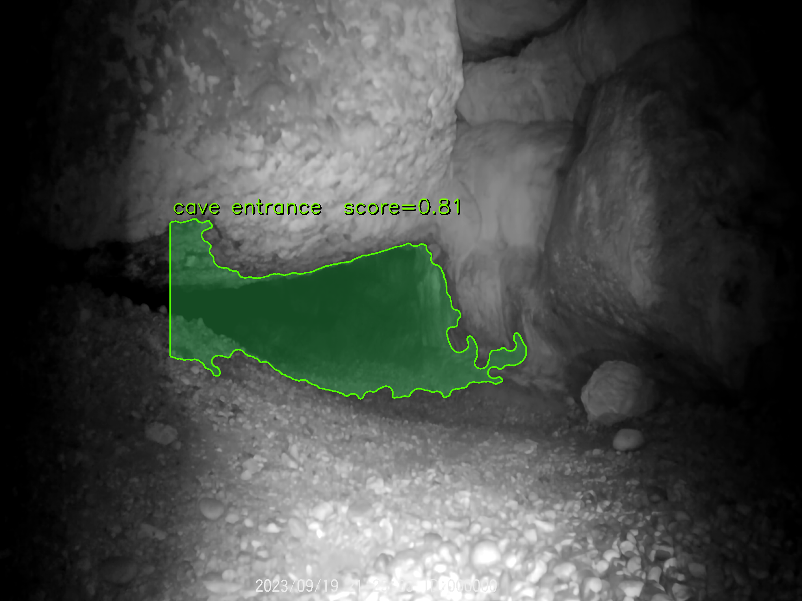
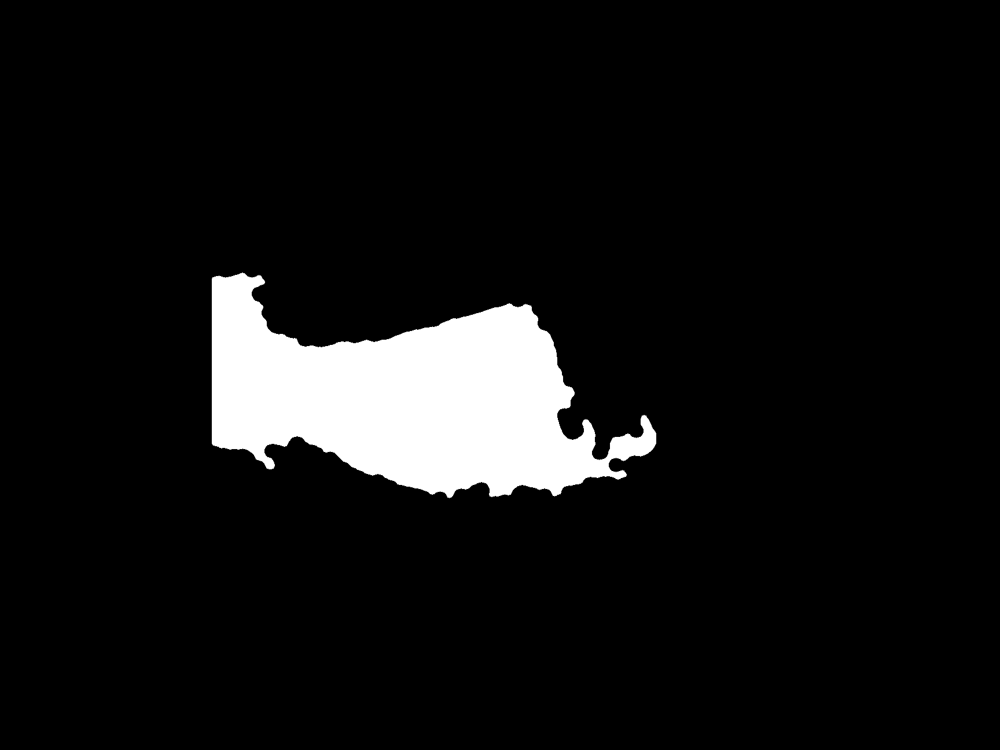
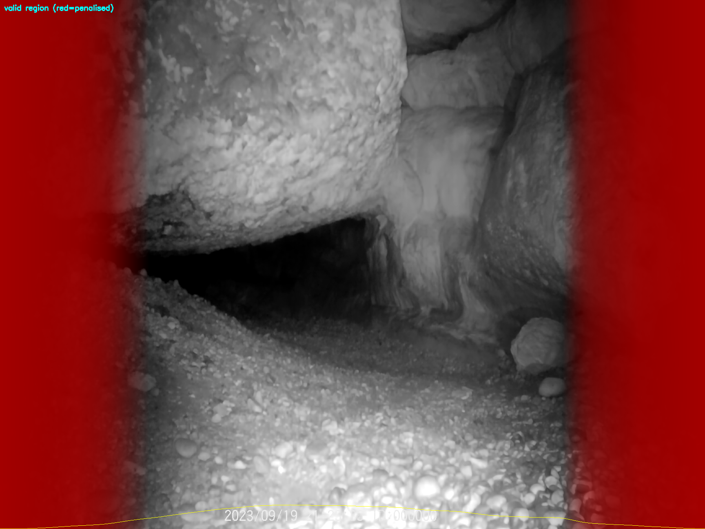
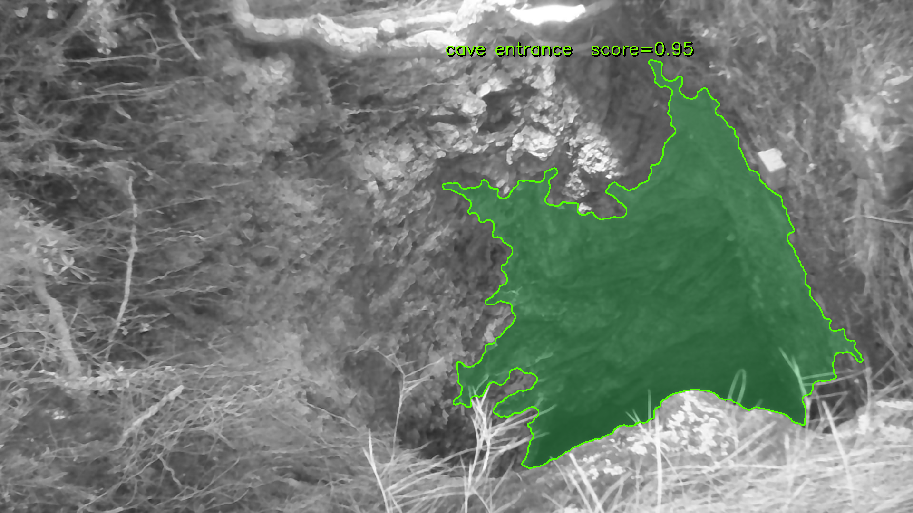
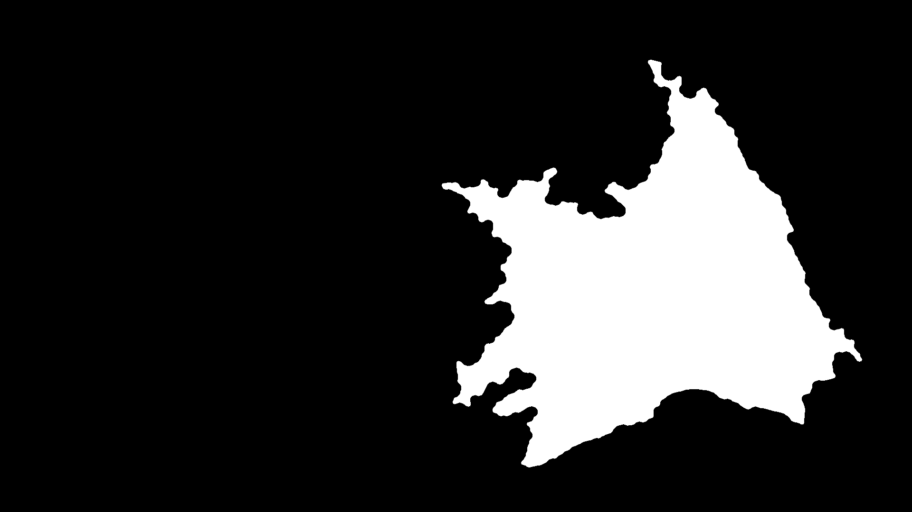
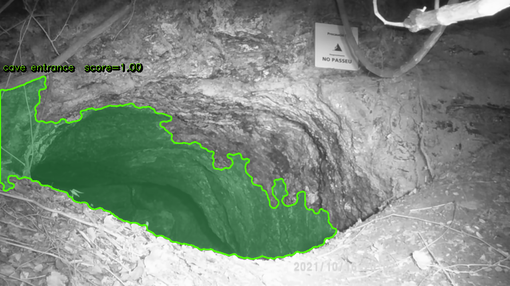
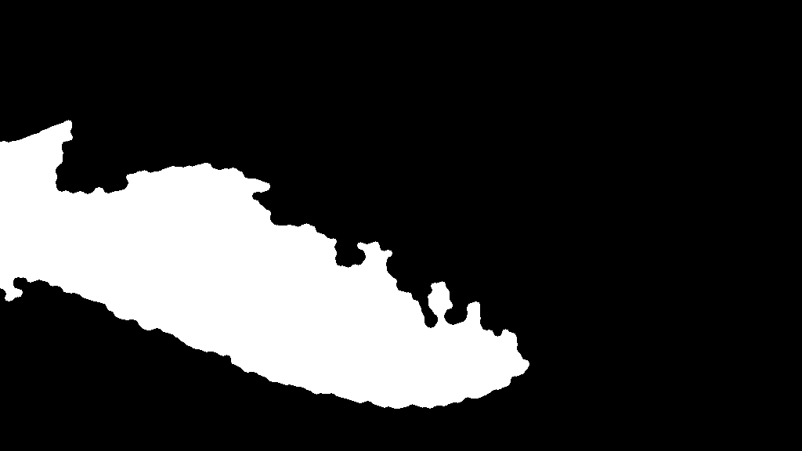
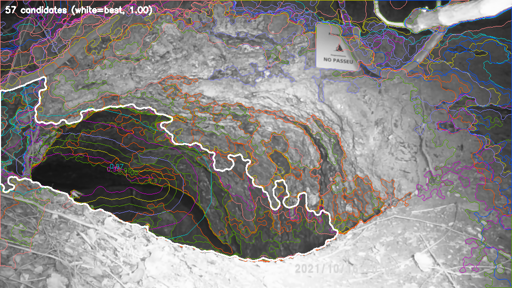

# CaveMark

Automatic cave entrance detector for IR/NIR monochrome imagery — no deep learning required.

CaveMark uses a classical computer vision pipeline (OpenCV + NumPy) to locate cave entrances in images captured by trail cameras, security cameras or NIR-equipped sensors in low-light or no-light conditions.

---

## How it works

```
Load → Preprocess → Valid Region → Candidates → Score → Expand → Refine → Visualise
```

1. **Preprocess** — median denoise + large-blur background estimation + division normalisation (corrects uneven IR illumination)
2. **Valid region** — horizontal illumination profile (80th percentile per column) builds a soft weight map that suppresses lateral dark borders caused by the camera's IR flash fall-off
3. **Candidate generation** — six complementary strategies:
   - Multi-level thresholding (standard and heavy morphological bridging)
   - Iterative seed-growth from the darkest pixels
   - Otsu thresholding
   - Adaptive threshold intersected with a dark base
   - Valid-zone-only masking (lateral shadows masked out before connected components)
4. **Scoring** — multiplicative gates prevent wrong-size or wrong-shape blobs from winning regardless of darkness:
   - Area gate: ideal 8 %–35 % of image; hard penalty below 2 % or above 50 %
   - Solidity gate: very non-convex shapes penalised
   - Additive components: contrast vs. surround, darkness, enrichment of darkest pixels, distance-transform depth, boundary gradient, valid-region alignment, aspect ratio, centroid position
5. **Post-selection expansion** — grows the selected mask into connected dark pixels at a relaxed threshold; captures pit entrances where the initial candidate covers only the darkest core
6. **Refine** — morphological close + bordered flood-fill to fill interior holes + largest-component selection

---

## Requirements

```
python >= 3.8
opencv-python
numpy
```

Install with:

```bash
pip install opencv-python numpy
```

---

## Usage

### Single image

```bash
python detect_cave.py input.jpg output.jpg
```

The output path only determines the output directory; four files are written per image (see [Output files](#output-files)).

### Batch mode

Run without arguments to process every `.jpg` / `.png` in the current directory (output files are excluded automatically):

```bash
python detect_cave.py
```

---

## Output files

For each input image `NAME.png` four files are produced:

| File | Description |
|------|-------------|
| `NAME_result.png` | Original image with green overlay, contour and score label |
| `NAME_mask.png` | Binary mask (white = cave entrance) |
| `NAME_debug_valid.png` | Valid-region weight map + illumination profile curve |
| `NAME_debug_candidates.png` | All scored candidates with their scores; best candidate in white |

---

## Examples

Three test images are included in the repository root (`background.png`, `background2.png`, `background3.png`). Run the detector:

```bash
python detect_cave.py
```

### background.png — horizontal slot entrance (1728 × 1296)

A cave entrance visible as a dark horizontal slot between a rock ceiling and a gravel floor. The image has strong IR flash fall-off on both lateral edges.

| Result | Mask |
|--------|------|
|  |  |

Score: **0.81** — area 7.4 %, contrast 0.61, depth 1.00

Valid-region weight map (lateral dark borders suppressed):



---

### background2.png — large vegetated entrance (1920 × 1080)

A wide cave entrance surrounded by vegetation. Uniform IR illumination — no lateral correction needed.

| Result | Mask |
|--------|------|
|  |  |

Score: **0.95** — area 16.3 %, contrast 0.92, depth 1.00

---

### background3.png — vertical pit entrance (1024 × 576)

A circular pit entrance viewed from above. The darkest core is only the deepest part; the full visible pit is recovered by post-selection expansion (8.9 % → 20.2 %).

| Result | Mask |
|--------|------|
|  |  |

Score: **1.00** — area 20.2 %, contrast 1.00, depth 1.00

Candidate scoring debug view:



---

## Scoring details

```
final_score = additive × area_mult × solidity_mult × lateral_pen

additive =
    0.26 × contrast_score        # brightness drop vs. surroundings (primary)
  + 0.16 × dark_score            # raw mean darkness
  + 0.08 × enrichment_score      # concentration of darkest 5 % of pixels
  + 0.16 × depth_score           # distance-transform depth (penalises narrow shadows)
  + 0.10 × gradient_score        # edge sharpness at boundary
  + 0.06 × valid_score           # alignment with illuminated zone
  + 0.04 × aspect_score          # not absurdly thin
  + 0.04 × position_score        # mild centre preference
  + 0.10                         # base
```

---

## Limitations

- Assumes a single dominant cave entrance per image
- Struggles when the entrance is brighter than its surroundings (e.g. back-lit scenes)
- Very thin or fragmented entrances may score lower than large dark shadows; tweak `min_area` and threshold percentiles if needed

---

## License

MIT
