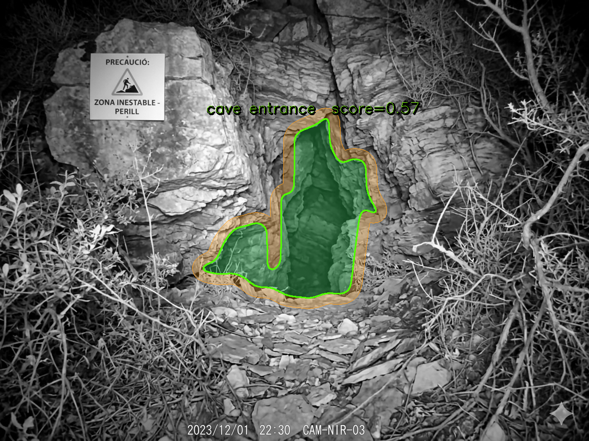
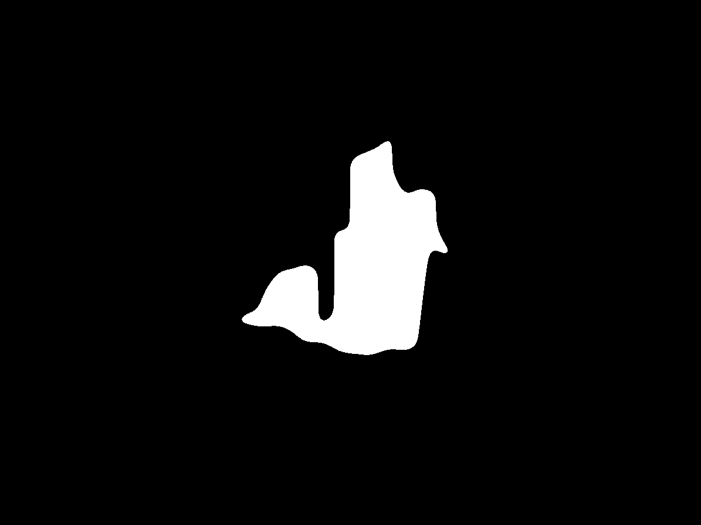
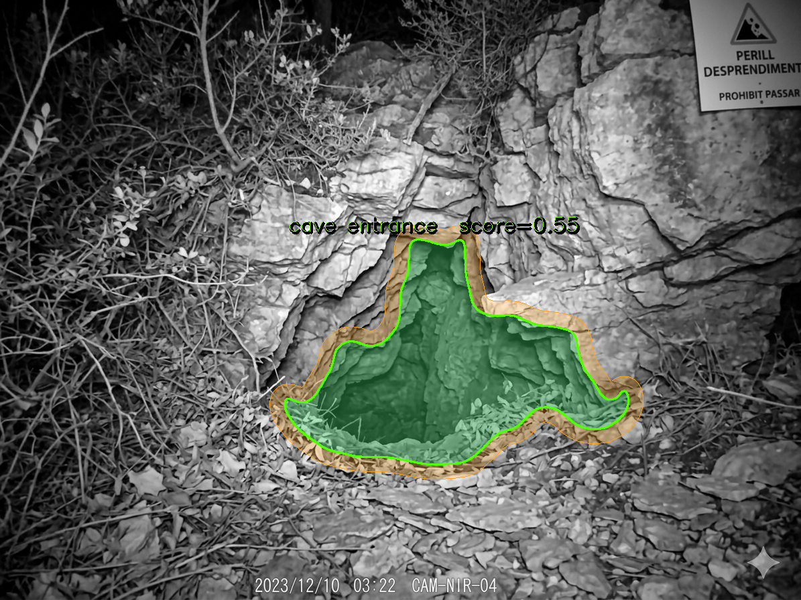
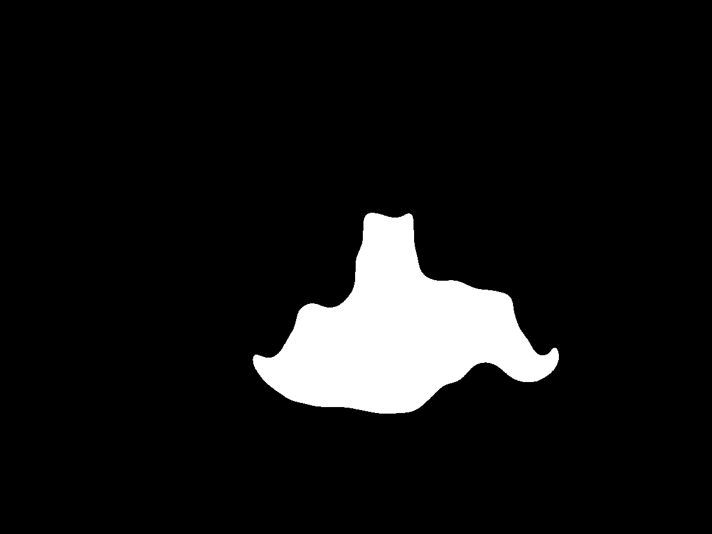
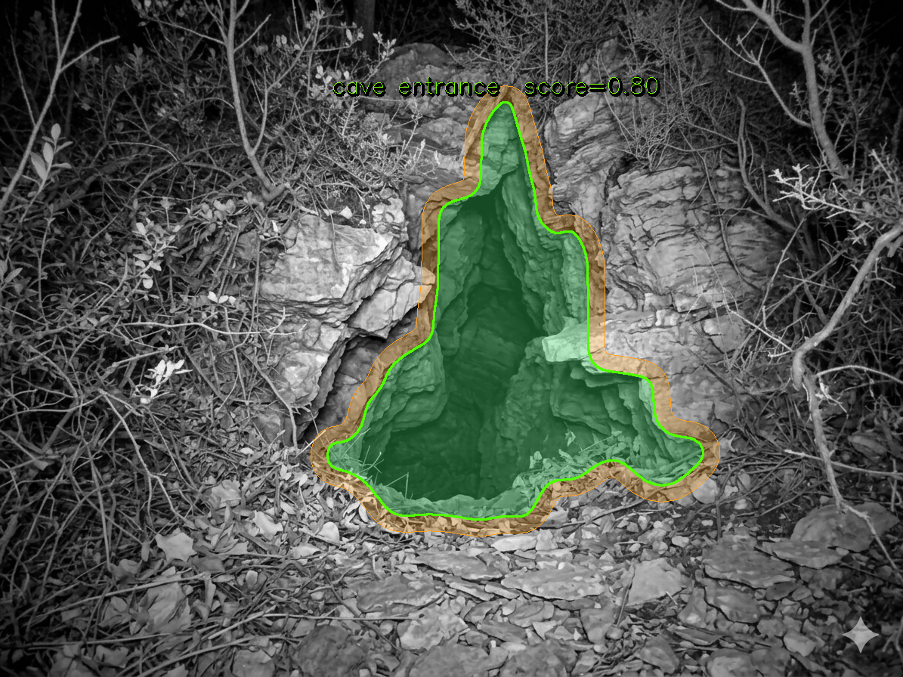
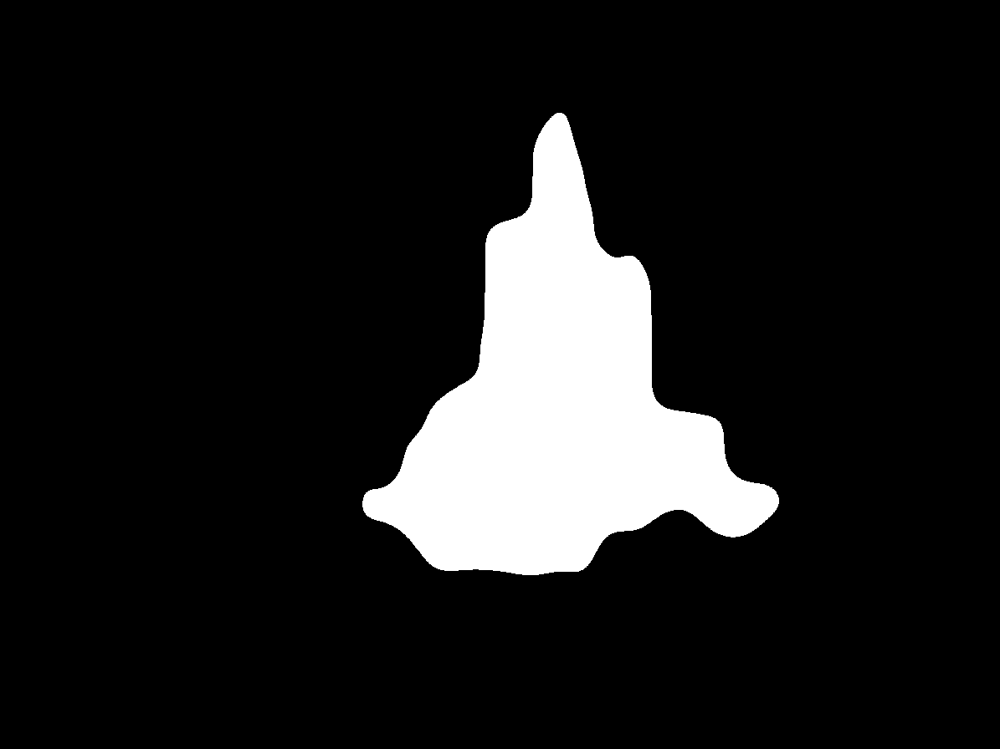
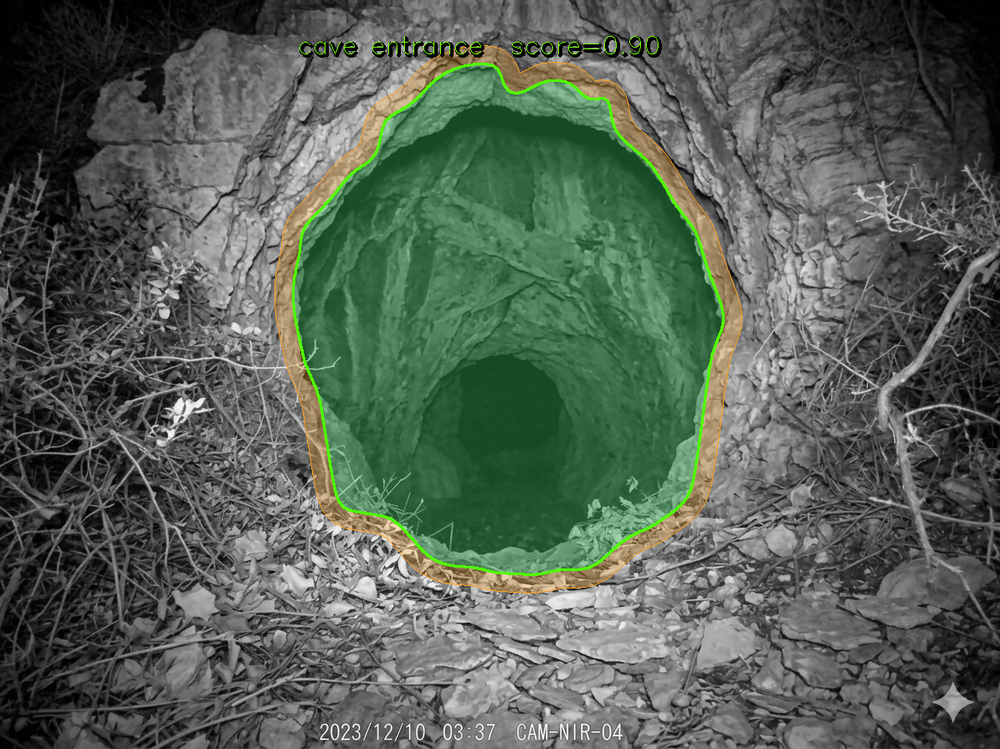
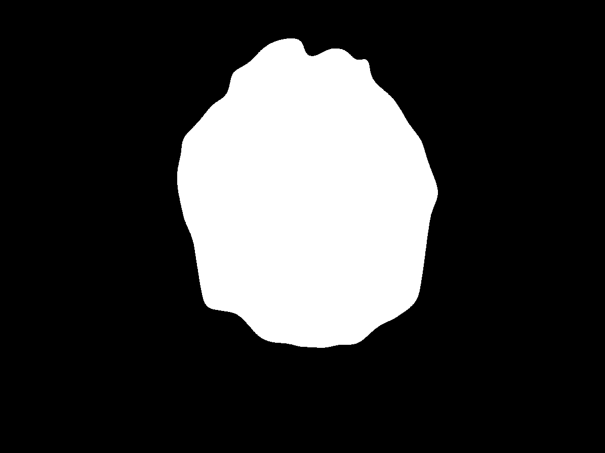
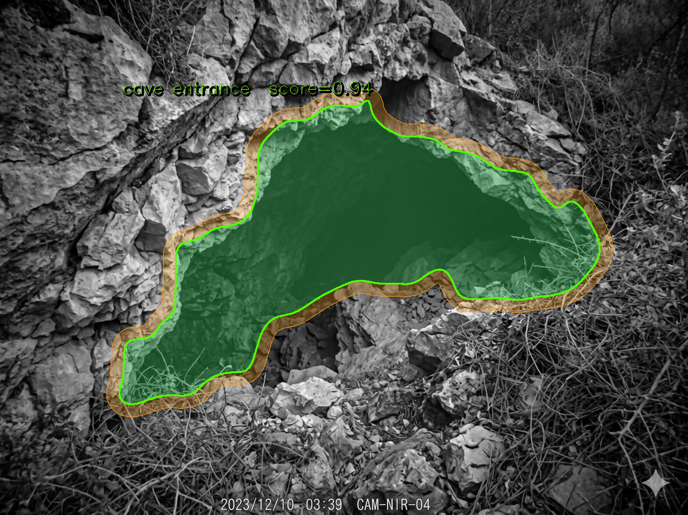
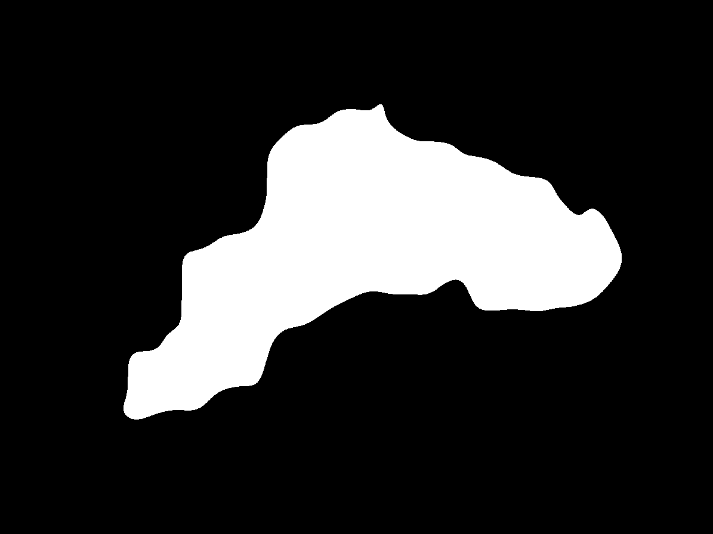

# CaveMark

Automatic cave entrance detector for IR/NIR monochrome trail-camera imagery.

CaveMark combines classical computer vision (OpenCV + NumPy) with two lightweight ONNX depth models to locate cave entrances in images from trail cameras, security cameras or NIR-equipped sensors in low-light or no-light conditions.

---

## How it works

```
Load → Preprocess → Valid Region → Depth Ensemble → Candidates → Score → Expand → GrabCut → Refine → Visualise
```

### 1. Preprocess
Median denoising + large-blur background estimation + division normalisation to correct uneven IR flash illumination.

### 2. Valid region
Per-column 80th-percentile brightness profile builds a soft weight map suppressing the lateral dark borders caused by IR flash fall-off. Candidates that lie mostly in these border zones are penalised.

### 3. Depth ensemble
Four complementary depth signals are blended into a single `depth_norm` map (0 = shallow, 1 = deep):

| Signal | Weight | Description |
|--------|--------|-------------|
| DepthAnything v2 Small | 42 % | ONNX ML model; primary signal, generalises well to IR/NIR |
| MiDaS v2.1 Small | 21 % | ONNX ML model; complementary architecture; auto-flipped when anti-correlated with DA2 |
| IR physics | 22 % | Domain-specific: `darkness × local_uniformity`; cave voids absorb all IR → near-black and uniform |
| Entropy | 15 % | Multi-scale local std; cave voids have low texture |

A two-component Gaussian Mixture Model on (DA2, Entropy) features identifies the "cave cluster" and contributes 35 % of the final score weighting.

### 4. Candidate generation
Seven strategies generate a pool of region proposals:

- Multi-level dark thresholding with standard and heavy morphological bridging
- Iterative seed-growth from the darkest pixels
- Otsu thresholding
- Adaptive threshold intersected with a dark base
- Valid-zone-only masking
- **Method J** — central dark seed grown through 75th / 60th percentile depth layers (bat_tracker-inspired)

### 5. Scoring
Each candidate receives a multiplicative final score:

```
total = additive × area_mult × solidity_mult × lateral_pen
      × dark_gate × texture_mult × vert_gate × dm_gate
```

**Additive components** (sum → 1.0):

| Component | Weight | What it measures |
|-----------|--------|-----------------|
| contrast | 0.26 | Brightness drop vs. surroundings (primary cave signal) |
| dark_score | 0.16 | Raw mean darkness inside the region |
| enrichment | 0.08 | Concentration of the darkest 5 % pixels |
| depth_score | 0.16 | Ensemble depth (deep = cave void) |
| depth_model | 0.10 | DA2+MiDaS model score specifically |
| gradient | 0.10 | Edge sharpness at the boundary |
| valid_score | 0.06 | Alignment with the illuminated zone |
| aspect | 0.04 | Not absurdly thin |
| position | 0.04 | Mild centre preference |

**Multiplicative gates:**

| Gate | Purpose |
|------|---------|
| `area_mult` | Ideal 8–35 % of image; hard penalty below 2 % or above 50 % |
| `solidity_mult` | Very non-convex shapes (holes, tendrils) penalised |
| `texture_mult` | High internal texture (std > 0.08) penalised; softened by depth-model bonus when dm > 0.50 **and** contrast ≥ 0.65 (real caves with ambient light) |
| `vert_gate` | Centroid in top 40 % of frame → penalty (sky/ceiling artefacts) |
| `dm_gate` | Low depth-model score (< 0.35) → soft penalty; prevents high-contrast non-caves overriding a clear "not deep" signal |
| `dark_gate` | Very bright interior → penalty |

### 6. Post-selection expansion
Conservative flood-growth from the winning candidate into connected dark pixels at a relaxed threshold. Stops when interior std rises (entering textured terrain) or area exceeds 25 %. Handles pit entrances where the initial candidate covers only the darkest core.

### 7. GrabCut refinement
A per-pixel Gaussian Mixture Model (dark interior vs. bright exterior) refines the boundary using graph-cut optimisation (min-cut/max-flow). Expansion limit: 2.5× to allow recovery of cave-interior rock/floor that is lighter than the pure void. The largest overlapping connected component is kept when GrabCut fragments the result.

### 8. Depth-guided expansion
When `depth_model_score ≥ 0.70`, adjacent pixels rated as "deep" by DA2 and darker than the 80th-percentile image brightness are added to the mask. This recovers visible cave interior surfaces (rocky floor, walls) that are lighter than the void ceiling. The guard (≥ 0.70) prevents over-expansion in forested scenes where DA2 is uncertain.

### 9. Bottom-contour snapping
Sobel-Y gradient on the inverted depth map snaps the lower mask boundary to the strongest rock-to-void depth transition, with moving-average smoothing (bat_tracker-inspired). `search_down = 8 px` to prevent floor creep.

### 10. Refine
Morphological CLOSE (2 % kernel) → bordered flood-fill (fills interior holes even when mask touches edges) → CLOSE + OPEN (9 × 9, smoothing) → largest connected component → Gaussian contour smoothing (σ ≤ 15, wrap-around, bounds-clamped) to remove notches.

### 11. Visualise
Result image shows:
- **Amber semi-transparent ring** (~2.5 % of min dimension) — dilation buffer zone around the detected mask
- **Green overlay + bright-green contour** — the detected cave entrance
- Score label

---

## Requirements

```
python >= 3.8
opencv-python
numpy
onnxruntime
scikit-learn
```

Install with:

```bash
pip install opencv-python numpy onnxruntime scikit-learn
```

### ONNX model files

Two model files must be present in the **same directory as `detect_cave.py`**:

| File | Source |
|------|--------|
| `depth_anything_v2_small.onnx` | DepthAnything v2 Small exported to ONNX |
| `midas_v21_small_256.onnx` | MiDaS v2.1 Small (256 × 256 input) |

Without these files the depth ensemble falls back to the IR-physics + entropy signals only (reduced accuracy).

---

## Usage

### One or more explicit images

```bash
python detect_cave.py image1.png image2.jpg ...
```

Output files are written to the **same directory as each input image**.

### Batch mode

Run without arguments to process every `.jpg` / `.png` in the script directory (output files are excluded automatically):

```bash
python detect_cave.py
```

---

## Output files

Five files are produced per input image `NAME.png`:

| File | Description |
|------|-------------|
| `NAME_result.png` | Original image with amber dilation ring, green cave overlay, contour and score label |
| `NAME_mask.png` | Binary mask (white = cave entrance) |
| `NAME_debug_valid.png` | Valid-region weight map + illumination profile curve |
| `NAME_debug_candidates.png` | All scored candidates with scores; best candidate in white |
| `NAME_debug_depth.png` | Depth ensemble heat map (blue = shallow, yellow = deep) |

---

## Examples

Eight test images are included in `examples/`. Run:

```bash
cd examples
python ../detect_cave.py background.png background2.png background3.png \
       background4.png background5.png background6.png background7.png background8.png
```

---

### background.png — horizontal slot entrance (1728 × 1296)

A cave entrance as a dark horizontal slot between a rock ceiling and a forest floor. Strong IR flash fall-off on both lateral edges; valid region covers columns 366–1377.

| Result | Mask |
|--------|------|
|  |  |

Score: **0.767** — candidate 22.0 %, final mask 18.9 %, depth_model 0.45

---

### background2.png — large vegetated entrance (1195 × 896)

A wide cave entrance surrounded by dense vegetation. Moderate IR uniformity.

| Result | Mask |
|--------|------|
|  |  |

Score: **0.804** — candidate 12.1 %, final mask 14.2 %, depth_model 0.40

---

### background3.png — vertical pit entrance (1195 × 896)

A near-circular pit entrance. The depth model rates it at 1.00 (maximum confidence).

| Result | Mask |
|--------|------|
|  |  |

Score: **0.973** — candidate 8.9 %, final mask 12.2 %, depth_model 1.00

---

### background4.png — narrow entrance with ambient interior light (1195 × 896)

Cave interior is lit by ambient light, making it appear "near" in IR physics. The depth ensemble correctly identifies it via DA2 (depth_model 0.86).

| Result | Mask |
|--------|------|
|  |  |

Score: **0.573** — candidate 4.6 %, final mask 5.6 %, depth_model 0.86

---

### background5.png — arch entrance with interior signs (1195 × 896)

Cave arch with signs/objects visible inside. IR physics fails (ambient light), but DA2 depth provides the correct depth signal.

| Result | Mask |
|--------|------|
|  |  |

Score: **0.546** — candidate 4.8 %, final mask 7.9 %, depth_model 0.73

---

### background6.png — small rock fissure entrance (1195 × 896)

A smaller entrance in a rocky cliff face.

| Result | Mask |
|--------|------|
|  |  |

Score: **0.803** — candidate 5.9 %, final mask 11.3 %, depth_model 0.76

---

### background7.png — forested cliff entrance (1195 × 896)

A cave entrance partially obscured by vegetation. MiDaS convention flipped (anti-correlated with DA2).

| Result | Mask |
|--------|------|
|  |  |

Score: **0.903** — candidate 12.1 %, final mask 22.0 %, depth_model 0.87

---

### background8.png — large rocky entrance with visible floor (1195 × 896)

A large cave entrance with rocky floor and walls visible inside. The depth-guided expansion (depth_model 0.96) recovers the lighter interior surfaces missed by the pure void detection.

| Result | Mask |
|--------|------|
|  |  |

Score: **0.936** — candidate 10.9 %, final mask 18.3 %, depth_model 0.96

---

## Limitations

- Assumes a single dominant cave entrance per image.
- Struggles when the entrance is brighter than its surroundings (back-lit scenes).
- The depth ensemble requires onnxruntime and the two ONNX model files; without them accuracy is reduced.
- Very thin or highly fragmented entrances may score lower than large dark shadow regions.
- Interior-lit caves (bg4, bg5) score lower because IR-physics signal fails; DA2 compensates but with less certainty.

---

## License

MIT
